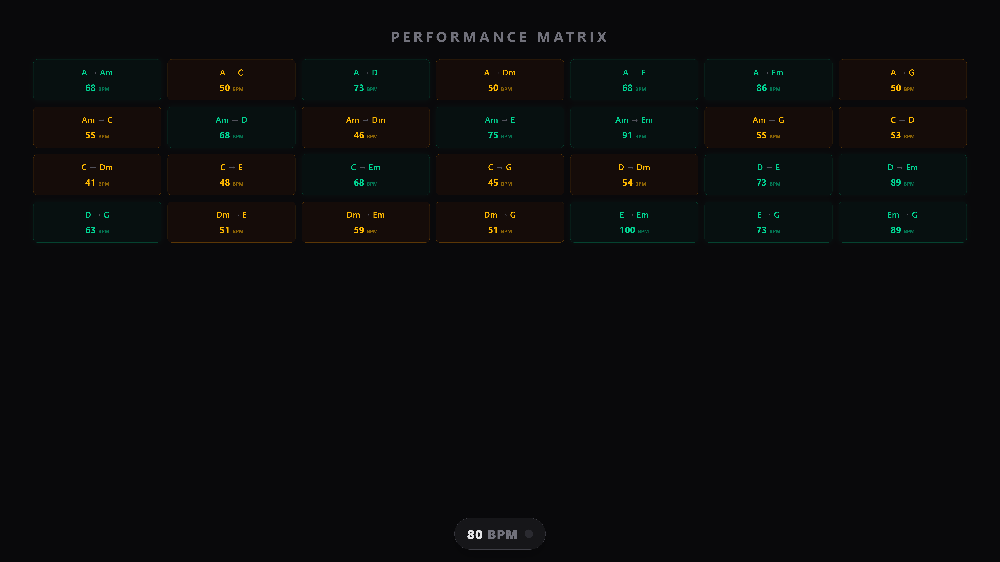

# Smart Kiosk Dashboard

A voice-controlled dashboard built to run 24/7 on a dedicated Ubuntu thin client. It handles real-time schedule tracking, system telemetry, and a set of offline guitar practice tools. The entire stack runs locally without cloud dependencies for voice processing.

## Features

### Offline Voice Control
* **Speech-to-Text:** Uses `openwakeword` for wake word detection and `vosk` for offline transcription.
* **Command Parsing:** A custom Python script handles phonetic variations and maps spoken strings to integer payloads.
* **Action Confirmation:** Database updates trigger a verbal "Yes/No" modal to prevent background noise from accidentally overwriting data.

### Guitar Practice Suite

  
  

* **Chord Hub:** Tracks chord transition speeds (BPM) with color-coded mastery thresholds.
* **SVG Chord Library:** Generates fretboard diagrams directly from database arrays.
* **Visual Metronome:** Syncs voice-commanded BPMs to a visual pulse and native Web Audio API clicks.
* **Practice Timer:** A 60-second countdown with a 5-second physical prep buffer and a synthesized completion chime.

### Dashboard & Telemetry
* **Rotating Views:** Idles between a monthly calendar and a rolling 7-day schedule based on activity timeouts.
* **Telemetry Bar:** Displays the local IP, API ping latency, request counts, and Vosk engine status.
* **Google Calendar:** Polls Google Calendar and color-codes specific event types for quick scanning.
* **Live Weather:** Pulls local weather data from the Open-Meteo API and maps it to WMO condition icons.

## Architecture

The system uses a 3-tier architecture:

* **Frontend (React + Vite):** The UI. It polls a central state file every 500ms to immediately reflect voice commands.
* **Backend (Node.js / Express):** A local API server. It proxies external API calls (Calendar, Weather) to avoid CORS/rate limits and manages read/write operations for the local database (`guitar_data.json`).
* **Voice Bridge (Python):** An isolated audio processing loop using PyAudio. It decodes intents and pushes REST commands to the Node backend.

## Hardware & Deployment

* **Hardware:** Lenovo ThinkCentre M700
* **OS:** Ubuntu Linux
* **Display:** Hosted locally on `http://localhost:5173` and rendered with Chromium.
* **Boot & Process Management:** An Ubuntu `.desktop` autostart configuration triggers `start-jarvis.sh` on login. This script manages port allocation, boots the Node servers in the background, runs the Python execution in an isolated `venv`, and forces Chromium into `--kiosk` mode with hardware autoplay enabled.

## Configuration & Security

* **Credentials:** All Google Cloud service account keys, location coordinates, API endpoints, and authentication tokens are managed via local `.env` files.
* **Version Control:** Standard `.gitignore` rules prevent staging of Python virtual environments, `node_modules`, build artifacts, and environment variables.